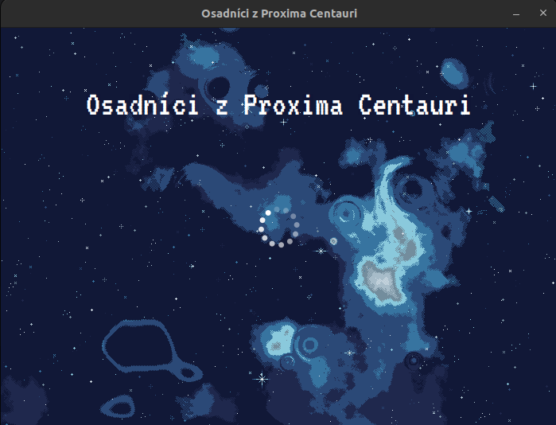
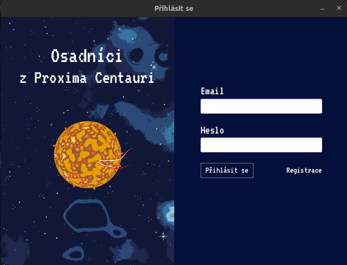
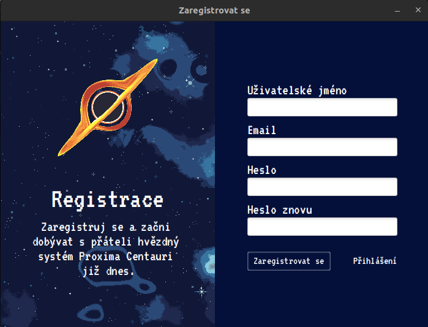
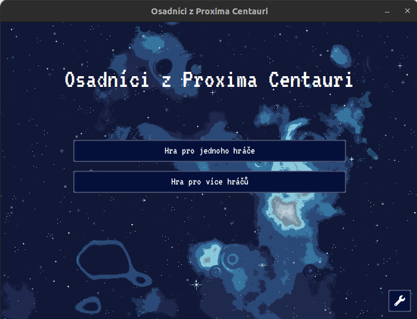
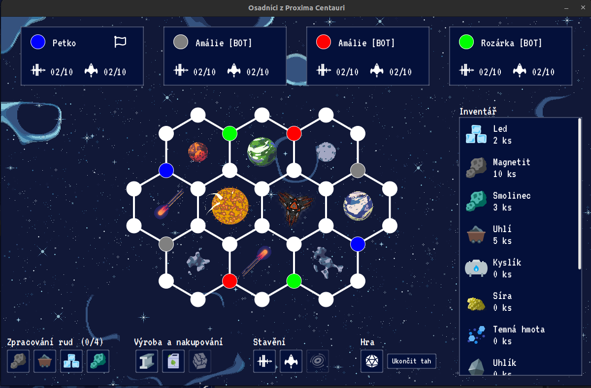
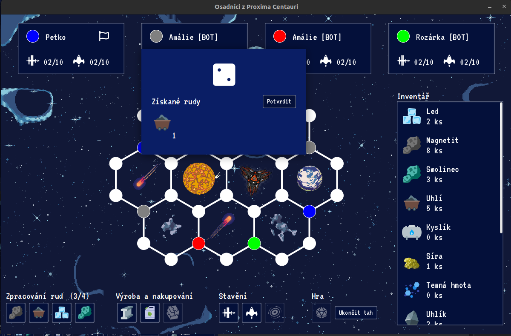

# sopc
Settlers of Proxima Centauri

This project is a seminar thesis for the course Java Programming Language. The topic of the thesis is a multiplatform computer game based on the board game `Settlers of catan junior`. It is only single player game (1 player + three bots).

The aim of the game is to build seven space stations as soon as possible and eight spaceships of your own colour to dominate the planetary system Proxima Centauri. Space stations can only be built on free spaces (circles) to which one of the spaceships is facing. Spaceships can only be built on roads
(lines between circles) and the ship must always fly from a space station. Materials and resources are used to build spaceships and stations.

Main and the only language of game is Czech.

## Screenshots

